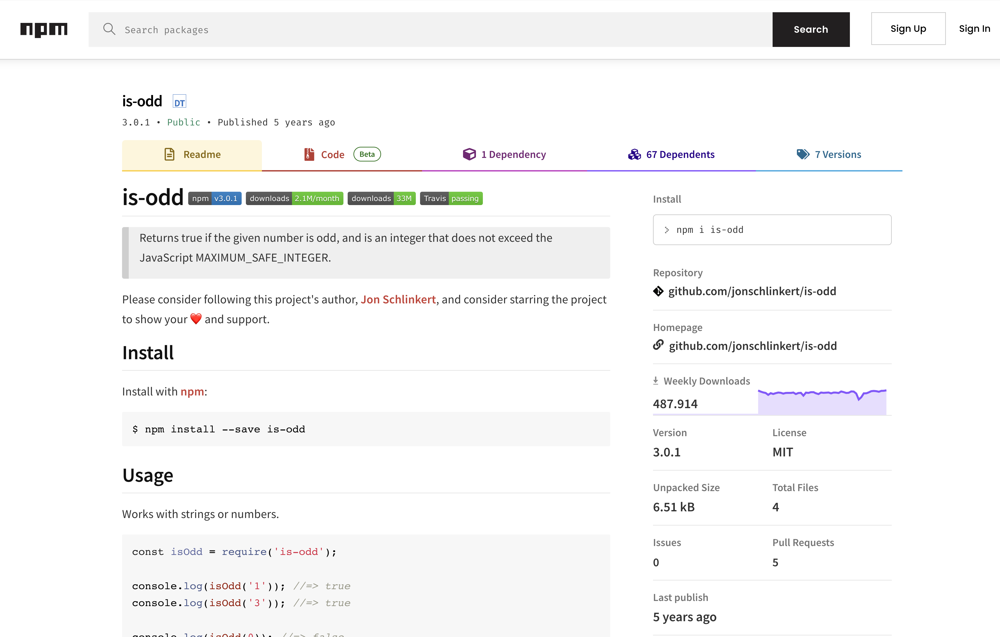
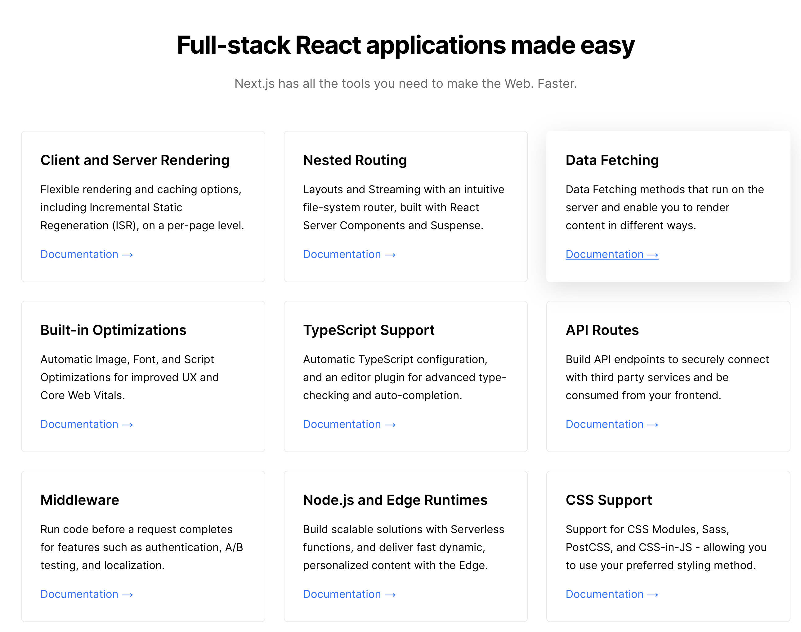

<style>
  marp-pre {
    background-color: #f1f5f9;
    color: #0f172a;
  }
</style>

# Learn React.js

Created by progwise.net

---


# About me

## Pascal Helbig

Fullstack Developer at progwise.net

---


# Format

- 🧑‍💻 **Workshop** - interaktiver Kurs
- ⚛ **Live Coding** - Mischung aus Vortrag und Demos
- 🛠️ **Aufgaben** - direktes Anwenden von neuem Wissen
- 🙋 **Fragen** - gerne direkt stellen

---

# Kurze Vorstellung

Welche Erfahrungen habt ihr mit:

1. HTML & CSS
2. JavaScript/TypeScript
3. React
4. anderen Frontend Libraries / Frameworks

---


# Was ihr braucht

- **Node.js** (mindestens Version 14)
- **npm** (mindestens Version 7)
- **Git**
- **Editor** (Empfehlung VSCode)

---

# Themen

- React Basics
- Form Handling
- Data Fetching
- Testing
- Styling
- (Redux)
- (Frameworks)

---


# Wir bauen eine Todo App!

---

# React.js Basics

---


# Was ist React.js?

- Open Source Bibliothek
- Entwickelt von Facebook
- Erstellung interaktiver Benutzeroberflächen
- Komponenten basierte Entwicklung

---


# React ist eine Bibliothek - Kein Framework

> Q: Wie lade ich Daten über das Netzwerk?
>
> Q: Wie erstelle ich Routing?
>
> Q: Wie funktioniert Form Handling?
>
> Q: Wie style ich Komponenten?

<br>

> React: Das entscheidest du 🤷‍♂️.

---



Kenne oder finde die richtige Library für dein Problem

---



# React Frameworks

- [Next.js](https://nextjs.org)
- [Remix](https://remix.run)
- [Astro](https://astro.build)
- [Gatsby](https://www.gatsbyjs.com)
- [Expo](https://expo.dev)

---


# React in a Nutshell

- Applikation wird in Komponenten unterteilt
- Funktionale Programmierung

---

# Erste Komponente

```tsx
const Greeting = () => {
  return <h1>Hello World</h1>;
};
```

oder

```tsx
function Greeting() {
  return <h1>Hello World</h1>;
}
```

---

# Komponente in HTML rendern

```tsx
import { createRoot } from "react-dom/client";

const root = createRoot(document.getElementById("app"));
root.render(<Greeting />);
```

---

# JSX

- Mischung aus HTML & JS
- Integration von JavaScript in HTML - dadurch keine Template Sprache notwendig
- Regeln
  - returns a single root element
  - close all tags
  - camelCase ~~all~~ most of things
- `className` statt `class` Attribut

https://react.dev/learn/writing-markup-with-jsx

---

# JSX

Mit JSX kann in JavaScript HTML Code geschrieben werden:

```tsx
return <div>Content of the div</div>;
```

---

# JSX

Um innerhalb HTML JavaScript zu verwenden werden geschweifte Klammern `{}` benutzt:

```tsx
return <span>Die Summe von 1 + 2 ist {1 + 2}</span>;
// Ausgegeben wird "<span>Die Summe von 1 + 2 ist 3</span>"
```

In den geschweiften Klammern kann jedes JavaScript Statement geschrieben (auch JSX).

---


# Action!

Live Demo in [Vite](https://vitejs.dev)

---

# Props

Ermöglichen:

- Daten an die Komponente zu übergeben
- Event Listener zu registrieren

```tsx
interface GreetingProps {
  name?: string;
}

export const Greeting = ({ name = "World" }: GreetingProps) => {
  return (
    <div>
      <h1>Hello {name}!</h1>
      <p>Welcome to my App</p>
    </div>
  );
};
```

---

# Props verwenden

- Props werden ähnlich wie HTML Attribute geschrieben
- Es gibt drei Schreibweisen:
  1. Anführungszeichen
  2. geschweiften Klammern
  3. ohne Wert

```tsx
// 1 - als String:
<Greeting propName="fixed string" />

// 2 - als Object (string/number/boolean/array/Object/etc.):
<Greeting propName={3} />
<Greeting propName={variable} />

// 3 - als true (boolean):
<Greeting propName />
```

---

# Children Props

- Children Prop funktioniert wie jeder andere Prop
- aber eigene Syntax
- wird genutzt für Verschachtelungen

---

# Children Props

```tsx
interface ListProps {
  children: ReactNode;
}

const List = (props: ListProps) => {
  return <ul>{props.children}</ul>;
};
```

```tsx
<List>
  <ListItem>Item 1</ListItem>
  <ListItem>Item 2</ListItem>
  <ListItem>Item 3</ListItem>
</List>
```

---

# Listen

- Arrays können mit der `.map()` Method in HTML Tags umgewandelt werden
- jeder Eintrag **muss** einen eindeutigen Key haben (Performance)

```tsx
<ul>
  {techStack.map((technology) => {
    return <li key={technology}>{technology}</li>;
  })}
</ul>
```

---

# Event Handling

---

# State

Mit dem `useState` Hook können einzelne States innerhalb von Komponenten erzeugt werden.

```tsx
const [value, setValue] = useState(0);
```

- `useState` gibt den aktuellen Wert und eine Setter Funktion als Array zurück
- mit dem Argument wird der initiale Wert definiert
- der State kann nur mit dem Setter verändert werden: `setValue(1)`
- jeder "State Change" erzeugt ein Rerendering der Komponente

---

# `useEffect`

---

# Installation eines UI Packages

https://mui.com/material-ui/getting-started/overview/
